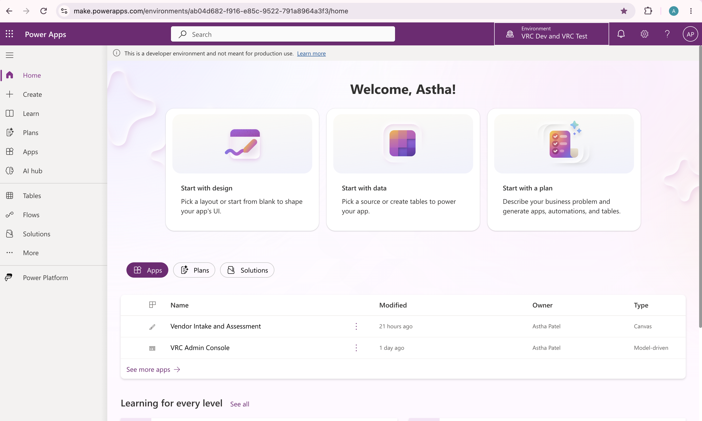
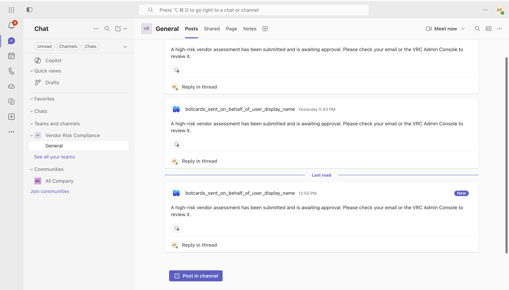

**[▶ Watch the 6-minute walkthrough]
(https://youtu.be/Ib378S8ZbV4)**

# Vendor Risk Compliance (VRC)

A Power Platform application that helps organizations track third-party vendors, run standardized risk assessments against them, and manage the findings and remediation that come out of those assessments.

Built as a portfolio project to demonstrate hands-on Power Platform development: Dataverse data modeling, model-driven and canvas apps, Power Automate approval workflows with Teams and email integration, security-role-based access control, and solution-based ALM (Application Lifecycle Management) across multiple environments.


## Why this project

Vendors (IT contractors, cloud providers, software suppliers, etc.) introduce risk to an organization — data they can access, systems they can touch, compliance obligations they inherit on the org's behalf. Most small and mid-size organizations track this in spreadsheets, which don't scale, don't enforce consistency, and don't create an audit trail. VRC replaces that spreadsheet with a structured system: every vendor gets assessed against the same 15-question control framework, every high-risk finding gets a named owner and a due date, and every high-risk assessment requires sign-off before it's considered approved.

## What it does

- **Vendor intake** — vendors are registered with basic profile information (contact, vendor type, data sensitivity, criticality).
- **Standardized assessments** — each vendor is assessed against a fixed 15-question control checklist based on the NIST Cybersecurity Framework and ISO 27001:2022. Each question is weighted; the weighted score determines a Low/Medium/High risk tier automatically.
- **Automated approval routing** — when an assessment's risk tier changes, an approval flow fires automatically. High-risk assessments route to a named approver by email and post a notification to a Microsoft Teams channel; the assessment record updates automatically once a decision is made.
- **Findings and remediation tracking** — issues identified during an assessment become Finding records with a remediation owner and due date. A scheduled flow sends reminders for anything overdue.
- **Self-service vendor submission** — a lightweight canvas app lets a Requester submit a new vendor for review without needing access to the full admin console.
- **Reporting** — built-in charts (Risk Tier distribution, Findings by Remediation Owner) give an at-a-glance view of vendor risk posture.

- **Role-based security** — three security roles (Admin, Assessor, Requester) control who can see and do what.

## How it's built

| Layer | Technology |
|---|---|
| Data model | Microsoft Dataverse (6 custom tables) |
| Admin application | Power Apps model-driven app ("VRC Admin Console") |
| Self-service application | Power Apps canvas app ("Vendor Intake and Assessment") |
| Automation | Power Automate cloud flows (approval routing, overdue reminders) |
| Collaboration | Microsoft Teams (automated notifications), SharePoint (evidence document library) |
| Reporting | Power Apps native charts against live Dataverse data |
| Packaging / deployment | Power Platform solutions (unmanaged for development, managed for deployment to a second environment) |

### Data model

| Table | Purpose |
|---|---|
| Vendor | Master record for each third-party vendor |
| Control | The 15 standardized assessment questions, each mapped to a framework (NIST CSF or ISO 27001:2022), a category, and a weight |
| Assessment | One assessment of one vendor at one point in time; carries the computed Risk Tier and Status |
| Assessment Response | The answer given to each Control question within a given Assessment |
| Finding | An issue raised from an assessment, with a remediation owner and due date |
| App User | Maps application users to their role for filtering/personalization |

### Scoring model

Each of the 15 control questions has a weight based on how much that control matters to overall vendor risk. An assessment's raw score is the sum of the weights of every "yes"/compliant answer. That raw score is converted to a 0–100 scale and mapped to a risk tier:

- **Low risk:** score under 30
- **Medium risk:** score 30–60
- **High risk:** score over 60

### Governance and approvals

Access is controlled through three Dataverse security roles:

- **VRC Admin** — full access to all tables, security configuration, and solution management. Gives final sign-off on high-risk vendors.
- **VRC Assessor** — can create and complete assessments, log findings, and record remediation status. Gives first-level sign-off on high-risk vendors before Admin review.
- **VRC Requester** — can submit new vendors for consideration via the self-service canvas app, with read access to their own submissions.

**Approval rule:** any assessment whose risk tier is set to High requires Assessor approval, followed by Admin approval, before it is considered finalized. This two-step approval is enforced by an automated flow (`VRC_AssessmentApproval`) that watches for risk tier changes, routes the approval request by email to the configured approver (stored as an environment variable, not hard-coded — so it can be changed per environment without editing the flow), and simultaneously posts a notification to a dedicated Microsoft Teams channel.


### Automation

- **VRC_AssessmentApproval** — triggers when an Assessment's Risk Tier changes. For High risk, requests approval by email and notifies Teams; updates the Assessment's Status based on the outcome.
- **VRC_OverdueReminders** — runs daily, checks all open Findings, and sends a reminder email for anything past its due date with a named remediation owner.

### Application Lifecycle Management (ALM)

The project follows a standard two-environment ALM pattern:

1. Built and tested in a development environment as an **unmanaged** solution (fully editable).
2. Exported and packaged as a **managed** solution (locked, versioned, deployment-ready).
3. Imported into a separate **test environment**, with environment-specific configuration (the approver email environment variable, connection references) reconfigured for that environment rather than hard-coded.

This mirrors how real organizations move customizations from a development environment into test/production without risking the source environment.

## Project structure

```
docs/               Requirements, assessment question bank, UAT plan, user guide
solution/            Exported managed solution package
screenshots/         Screenshots of the application in use
powerbi/             Reporting notes (see below)
sample_data/         Sample vendor/control data used for testing
```

## A note on reporting

The original plan called for a Power BI dashboard. During development, Power BI Desktop wasn't available (no Windows environment) and editing a semantic model directly in Power BI service was blocked by a regional licensing restriction on Pro workspaces (confirmed by testing directly, including trying a brand-new workspace with every available workspace type). Rather than leave reporting out, the same reporting requirement was met using **Power Apps native charts** connected live to the same Dataverse tables — a fully valid Power Platform reporting approach, just a different tool than originally planned.

## Status

This is a completed portfolio project. It is not connected to a production vendor risk process for any real organization.
