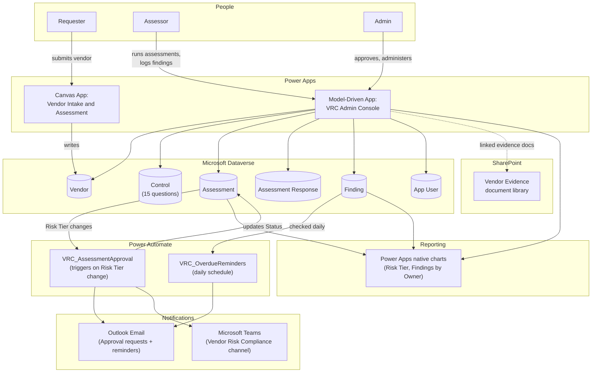
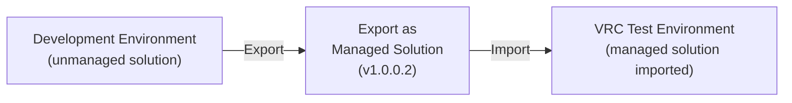

# Architecture — Vendor Risk Compliance

This diagram shows how the pieces of the system fit together. It renders automatically as a picture when viewed on GitHub.

## Environment topology (ALM)

Development happens in the primary environment as an unmanaged (freely editable) solution. When a version is ready to move forward, it's exported as a managed solution and imported into the separate "VRC Test" environment, where environment-specific settings (like the Approver Email environment variable and connection references) are reconfigured rather than hard-coded into the flow logic.
